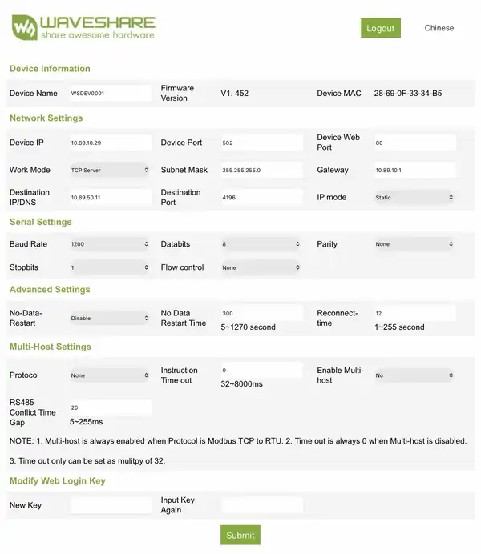

<p align="center">
  
</p>

<h1 align="center">Aquagem Pumps — Home Assistant</h1>
<p align="center"><strong>Local control and diagnostics for compatible Aquagem variable-speed pool pumps.</strong></p>
<p align="center">RS485 · Local polling · No cloud</p>

<p align="center">
  <a href="https://github.com/jptstar/ha-aquagem-isaver/releases"></a>
  <a href="https://github.com/hacs/integration"></a>
  <a href="LICENSE"></a>
</p>

---

## Compatibility

The integration is structured around the **detected local protocol**, not only the commercial model name.

| Protocol profile | Validated hardware | RS485 serial | Control | Status |
|---|---|---|---|:---:|
| **C3 / D0** | **iSaver Power 1100** | `1200-8-N-1` | RPM `1200–2900`, OFF=`1` | ✅ Validated |
| **Modbus 03 / 10** | **DM15 / INVERsilence** | `9600-8-N-1` | Capacity `30–100%`, OFF=`0` | ✅ Validated |

> [!TIP]
> **Not listed does not necessarily mean unsupported.** Automatic detection validates protocol signatures. Compatible Aquagem pumps using the same standard Modbus register layout may work even when their commercial model name is not yet listed.

The DM15 field validation confirmed, on real hardware:

- slave address `0xAA`
- function `0x03` reads holding registers `2001..2004`
- register `2003` follows the physical running capacity
- function `0x10` writes register `3001`
- commands `30%`, `50%`, `70%` and `100%`
- `3001 = 0` stops the pump
- valid write acknowledgements and CRCs throughout the test sequence

The Modbus register stores an integer capacity from `30` to `100`, so the integration exposes a **1% control grid**. The independently field-tested checkpoints are currently 30/50/70/100%.

---

## At a glance

| | What the integration exposes |
|---|---|
| 🎛️ **Main control** | Home Assistant `fan` entity with ON/OFF and variable speed |
| 📈 **Live value** | iSaver actual RPM or Modbus pump running capacity (%) |
| 🎯 **Direct setpoint** | RPM setpoint for iSaver · capacity setpoint for Modbus pumps |
| 🚨 **Diagnostics** | Global alarm, raw fault word and protocol-specific fault bits |
| 🔌 **Connection** | Local RS485/TCP gateway health |
| ☁️ **Cloud** | Not required |

No MQTT or Node-RED is required once the integration is installed.

---

## Automatic protocol detection

**Automatic detection is the normal setup path.** The user enters only the device name, gateway IP address and TCP port.

Detection sends **read-only probes only**:

1. validate the proprietary iSaver C3 response signature and CRC;
2. validate the standard Aquagem pump Modbus `03` response for registers `2001..2004`;
3. try Modbus address `0xAA` first;
4. if required, scan the configurable Aquagem Modbus range `0xA0..0xBF`;
5. accept a profile only when the response structure, CRC, state and running-capacity values are coherent.

A generic Modbus reply is **not enough** to identify an Aquagem pump.

Once identified, the protocol and Modbus address are stored in the Home Assistant config entry. Normal polling then uses only that profile; auto-detection is not repeated every cycle.

### Manual fallback

If automatic signature detection fails, Home Assistant offers a manual fallback:

- **iSaver Power 1100 — C3/D0**
- **DM15 / Aquagem Modbus pump — 03/10**

The forced profile is still validated with a **read-only request before saving**.

> [!IMPORTANT]
> Home Assistant cannot change the WaveShare's RS485 baud rate through a transparent TCP connection. Set the gateway serial side correctly before retrying detection:
>
> - iSaver C3/D0 → **1200 baud**
> - DM15 / standard Aquagem pump Modbus → **9600 baud**

---

## Home Assistant fan control

Both supported protocol families use the same Home Assistant **fan entity** so the user gets one familiar variable-speed pump control.

### iSaver Power 1100

| Control | Behaviour |
|---|---|
| OFF | validated persistent command value `1` |
| ON | restores the last running RPM |
| Fan speed | HA 0–100% mapped to the configured RPM range |
| Physical range | `1200–2900 rpm` |
| RPM grid | `100 rpm` |
| Profiles | Max · Day/Jour · Eco · Night/Nuit · Custom/Perso |

The profiles are Home Assistant RPM shortcuts; they are not claimed to be native iSaver panel modes.

### DM15 / standard Aquagem pump Modbus

| Control | Behaviour |
|---|---|
| OFF | writes `3001 = 0` |
| ON | restores the last running capacity |
| Fan speed | uses the pump's real running-capacity percentage |
| Physical range | `30–100%` |
| Control grid | `1%` integer register resolution |
| Profiles | none; the native percentage is exposed directly |

Values below 30% requested through the generic HA fan slider are clamped to the documented physical minimum of 30%. `0%` means OFF.

On the validated DM15, acceleration to 100% can take more than three seconds. Register `2003` reports the actual current capacity during that ramp, so a transitional value such as 95% is normal before the pump reaches 100%.

---

## Entities

Common entities:

| Entity | Type | Role |
|---|---|---|
| Pump | Fan | ON/OFF and variable-speed control |
| Alarm | Binary sensor | complete fault word != 0 |
| Raw fault code | Sensor | protocol fault word |
| Connection | Binary sensor | coordinator/gateway communication |

Protocol-specific entities:

| Profile | Entity | Source / unit |
|---|---|---|
| iSaver C3/D0 | Actual speed | status field / rpm |
| iSaver C3/D0 | RPM setpoint | direct RPM command |
| iSaver C3/D0 | documented iSaver fault bits | diagnostic binary sensors |
| Modbus 03/10 | Running capacity | register `2003` / % |
| Modbus 03/10 | Capacity setpoint | register `3001` / % |
| Modbus 03/10 | 16 documented fault bits | register `2001` |
| Modbus 03/10 | Register 2004 (raw) | diagnostic, disabled by default |

Register `2004` is intentionally left **raw** because its unit has not yet been independently established. The integration does not assign an estimated meaning to it.

Entity display names are localized in English and French. Internal unique IDs remain language-neutral so changing the Home Assistant interface language does not break automations.

---

## Device naming

The Home Assistant integration entry includes the gateway IP address, for example:

```text
iSaver Power 1100 10.89.10.29
DM15 Pool 192.168.13.181
```

The device itself keeps the clean user-defined name. This makes multiple pumps/gateways easy to distinguish without adding the IP address to every entity name.

---

## Options

Open **Settings → Devices & services → Aquagem Pump → Configure**.

All profiles expose:

| Option | Default | Limits |
|---|---:|---|
| Polling interval | `5 s` | 5–300 s |

The iSaver C3/D0 profile additionally exposes configurable RPM limits and Max/Day/Eco/Night Home Assistant shortcuts. Standard Modbus percentage pumps use their native fixed `30–100%` operating range directly.

---

## Installation

### HACS

<p align="center">
  <a href="https://my.home-assistant.io/redirect/hacs_repository/?owner=jptstar&repository=ha-aquagem-isaver&category=integration">
    
  </a>
</p>

Or add `jptstar/ha-aquagem-isaver` as **HACS → Custom repositories → Integration**, install the integration, restart Home Assistant, then add **Aquagem Pump** from **Settings → Devices & services**.

### Manual

Copy:

```text
custom_components/aquagem_isaver
```

into the Home Assistant `custom_components` directory, then restart Home Assistant.

---

## RS485/TCP gateway setup

Use a **transparent RS485-to-TCP gateway**.

Common WaveShare settings:

| WaveShare setting | Required value |
|---|---|
| Work Mode | `TCP Server` |
| Device Port | `502` |
| Databits | `8` |
| Parity | `None` |
| Stopbits | `1` |
| Flow control | `None` |
| Protocol | `None` |
| Enable Multi-host | `No` |

Serial baud rate depends on the detected pump protocol:

| Protocol | Baud |
|---|---:|
| iSaver C3/D0 | `1200` |
| Aquagem pump Modbus 03/10 | `9600` |

> [!IMPORTANT]
> Keep the WaveShare in transparent mode with **Protocol None**. Do not enable the gateway's **Modbus TCP to RTU** conversion mode; the integration sends complete RTU frames through the transparent TCP stream.

### Validated iSaver WaveShare example

<p align="center">
  
</p>

The image is a cropped capture of the validated iSaver configuration. Network addresses are installation-specific.

---

## Protocol reference

### iSaver Power 1100 — proprietary C3/D0

Validated status request:

```text
AA C3 07 D1 00 02 8C 8C
```

Response:

```text
AA C3 [fault hi] [fault lo] [state] [speed hi] [speed lo] [CRC lo] [CRC hi]
```

Speed write prefix:

```text
AA D0 0B B9 [speed hi] [speed lo] [CRC lo] [CRC hi]
```

For the validated iSaver Power 1100, **OFF intentionally uses value `1`** because it gives the persistent RS485 stop behaviour observed on the real unit.

### DM15 / Aquagem standard pump Modbus

Validated read:

```text
slave 0xAA
function 0x03
start 2001
count 4
```

Registers:

| Register | Validated interpretation |
|---:|---|
| `2001` | fault bitfield |
| `2002` | operating state (`0` OFF, `1` ON) |
| `2003` | actual running capacity (%) |
| `2004` | live raw value; unit intentionally unassigned |

Validated write:

```text
function 0x10
register 3001
0      = OFF
30..100 = running capacity (%)
```

The integration validates complete RTU CRCs and write acknowledgements.

---

## Hardware validation tools

Two standalone tools are kept for protocol validation and troubleshooting:

- [`tools/dm15_read_probe.py`](tools/dm15_read_probe.py) — strictly read-only DM15 probe
- [`tools/dm15_full_probe.py`](tools/dm15_full_probe.py) — interactive full validation including guarded speed and OFF write tests

The full probe requires explicit confirmations before writes and asks the tester to remain physically next to the pump with manual or electrical control available.

---

## Validation policy

Protocol support is marked as validated only after repeatable checks on real hardware.

Automatic detection relies on a complete protocol signature — frame structure, CRC and plausible register/state values — rather than accepting any TCP connection or generic Modbus response.

Values whose meaning or unit has not been independently established remain explicitly raw or experimental.

---

## Contributions & credits

Aquagem Pump benefits from independent real-hardware testing. Credits are intentionally specific and describe only the contribution that directly helped validate the integration.

- **Antonio Garcia** — independent **DM15 / INVERsilence** hardware validation. Antonio tested the read-only register map and then completed the guarded Modbus write sequence on his real pump, confirming `9600-8-N-1`, registers `2001..2004`, running-capacity feedback through `2003`, `3001` commands at 30/50/70/100%, valid function `0x10` acknowledgements, and the final `3001 = 0` OFF command.

Thanks also to everyone who shares diagnostics, device variants, protocol captures, bug reports and real-hardware test results. Concrete compatibility or protocol validation can be credited here for the specific work it established.

---

## Project

> [!IMPORTANT]
> **Unofficial community project.** Aquagem Pump is independent and is not developed, approved, endorsed or maintained by Aquagem.

Created and maintained by **Jean-Philippe TESTART · `jptstar`**  
*Developed and shared for fun, technical curiosity and the Home Assistant community.*

---

## License

Copyright © 2026 Jean-Philippe TESTART (`jptstar`).

Distributed under the **MIT License**. See [LICENSE](LICENSE).
